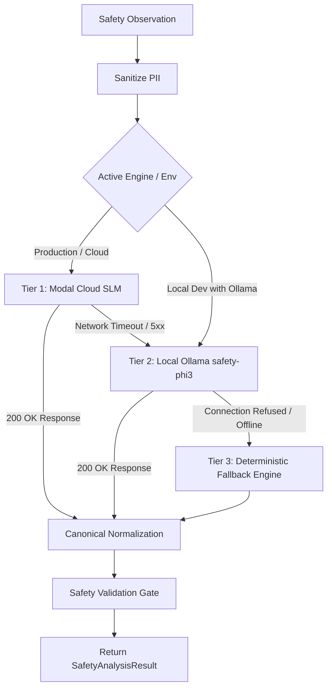
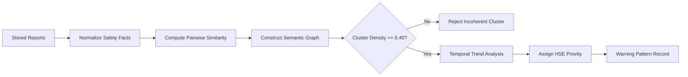
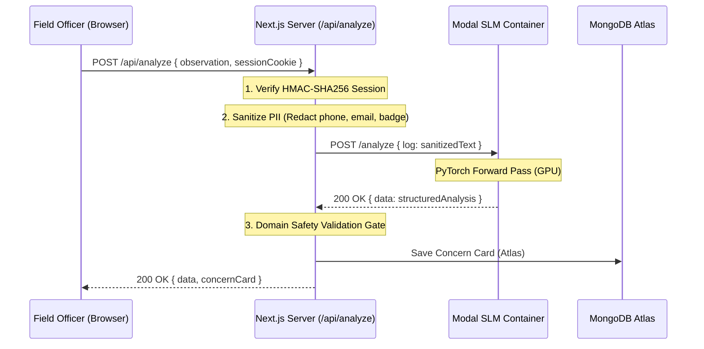

# SentinelSIF AI — System Architecture & Technical Specification

> **SIH 2026 Evaluation Reference Document**  
> **Category**: Technology & Architecture (20 Marks)  
> **Domain**: Oil India Limited (OIL) HSE Precursor Intelligence & Life-Saving Rules Platform  
> **Status**: Hardened & Verified Production Architecture

---

## 1. 30-Second Executive Pitch (For SIH Judges)

> *"SentinelSIF AI is not a generic chatbot or accident prediction claim. It is an **AI-assisted safety intelligence and prioritization system** designed for Oil India Limited (OIL).
> 
> When a safety observation arrives—whether typed by a field officer or uploaded via bulk CSV—it is first stripped of personal identifiers (PII). It then routes through our **three-tier inference pipeline**: primary inference is powered by our custom **Fine-Tuned Phi-3 Mini SLM + LoRA** hosted in a cloud container on Modal, with automatic failover to a **local edge Ollama model**, and finally an in-memory **deterministic safety engine**.
> 
> The linguistic output is cross-referenced against a **controlled domain safety validation layer** adhering to the **IOGP 9 Life-Saving Rules**, ensuring compliant operations are never falsely flagged. The structured facts are persisted to **MongoDB Atlas**, where our **Cross-Report Pattern Engine** runs graph clustering and temporal trend analysis to detect recurring systemic weaknesses across sites—even when reported in completely different wording.
> 
> Finally, installations and activities are ranked by **HSE Intervention Priority**—prioritizing where human HSE managers need to investigate most urgently. Human HSE experts review, confirm, or correct AI outputs, creating an auditable feedback loop for continuous model improvement."*

---

## 2. System Architecture Diagram

```
                       OIL FIELD SAFETY OBSERVATIONS
                  (Unsafe Act / Unsafe Condition / Near Miss / CSV)
                                       │
                                       ▼
                         [INGESTION & VALIDATION LAYER]
                             - RFC 4180 CSV Parser
                             - Duplicate Fingerprint Detection (SHA-256)
                                       │
                                       ▼
                          [PII SANITIZATION LAYER]
                             - Conservative Regex/Entity Redaction
                             - Redacts Phone, Email, Badge IDs
                             - Preserves Rig #, Well #, Valve #
                                       │
                                       ▼
                       [AI / NLP INFERENCE ORCHESTRATOR]
                                       │
             ┌─────────────────────────┼─────────────────────────┐
             │                         │                         │
             ▼                         ▼                         ▼
   Cloud Fine-Tuned SLM         Local Ollama Model        Deterministic Fallback
 (Microsoft Phi-3 Mini 3.8B   (Local Edge Ollama phi3)     (In-Memory Rule Baseline
  + LoRA Adapter on Modal)                                  Zero Network Latency)
             │                         │                         │
             └─────────────────────────┼─────────────────────────┘
                                       │
                                       ▼
                       [CANONICAL SAFETY ANALYSIS SCHEMA]
                             - SIF Potential & SIF Category
                             - SIF Score & Extraction Confidence
                             - Initiating Hazard & Possible Consequence
                             - IOGP Life-Saving Rules (Multi-Rule)
                             - Safety Protection & Failure State
                             - Evidence Quote & Traceability
                                       │
                                       ▼
                      [SAFETY RULES & VALIDATION LAYER]
                             - IOGP 9 Standardized Verification
                             - Compliance Negation Guard (Zero False Alarms)
                             - Conflict Flag: "NEEDS_HSE_REVIEW" (No Silent Overwrite)
                                       │
                                       ▼
                         [DATA / PERSISTENCE LAYER]
                        (MongoDB Atlas / Local Fallback)
                             - Concerns Collection
                             - Board State (Kanban Workflow)
                             - Users Collection & Sessions
                                       │
                                       ▼
                      [CROSS-REPORT PATTERN INTELLIGENCE]
                             - Normalized Safety Facts
                             - Pairwise Semantic & Structural Linkage
                             - Coherent Graph Clustering (Density Gate ≥ 0.40)
                             - Rolling Temporal Trends (NEW / INCREASING / DECREASING)
                                       │
                                       ▼
                       [HSE PRIORITIZATION & ANALYTICS]
                             - SIF Precursor Density Ranking
                             - Precursor-Weighted Site Ranking (Not raw volume)
                             - Executive Bento Dashboard Telemetry
                                       │
                                       ▼
                         [HUMAN HSE REVIEW WORKFLOW]
                             - Reviewer Session & Identity Verification
                             - AI Assessment Preserved Unchanged
                             - HSE Expert Confirmation / Correction
                             - Audit Record & Feedback Dataset Generation
```

---

## 3. Core Architectural Layers & Component Responsibilities

| Layer | Physical Location | Responsibility & Boundary |
| :--- | :--- | :--- |
| **A. Types** | `types/` (`safety.ts`, `concerns.ts`, `patterns.ts`, `users.ts`) | Single source of truth for canonical domain types. Zero runtime logic. |
| **B. Safety Rules & Taxonomy** | `lib/safety/` (`lsr.ts`, `barriers.ts`, `validation.ts`) | Controlled IOGP 9 Life-Saving Rules catalog. Barrier extraction (`safety_protection`, `protection_failure_state`). Compliance negation checks. Flags conflicts for HSE review without silent overwriting. |
| **C. AI Orchestration & PII** | `lib/ai/` (`pii-sanitization.ts`, `modal.ts`, `ollama.ts`, `deterministic-fallback.ts`, `orchestrator.ts`) | PII redaction (redacts phone, email, badge IDs; preserves Rig #, Well #). Multi-tier routing across Modal Cloud SLM, Local Ollama, and Deterministic Fallback. Returns canonical schema. |
| **D. Pattern Intelligence** | `lib/patterns/` (`normalization.ts`, `similarity.ts`, `clustering.ts`, `trends.ts`, `detector.ts`) | Pure domain service decoupled from React and database. Normalizes safety facts, links semantically related reports, validates cluster graph density, and detects temporal trends. |
| **E. HSE Prioritization** | `lib/prioritization/` (`priority-score.ts`) | Mathematical, auditable prioritization calculations for warning patterns and operational sites based on precursor severity and barrier criticality (not raw volume). |
| **F. Persistence / Data** | `lib/data/` (`mongodb.ts`, `concerns.ts`, `users.ts`) | MongoDB Atlas operational source of truth. Connection pooling with graceful in-memory/file fallback. **ARCHITECTURAL INVARIANT: Must NOT depend on or import AI.** |
| **G. Security & RBAC** | `lib/auth/` (`auth.ts`) | Stateless HMAC-SHA256 session tokens. Server-side role enforcement (`worker` vs `manager`). Strict IDOR isolation for field officers. |
| **H. Presentation** | `components/worker/`<br>`components/manager/`<br>`components/hse/`<br>`components/landing/`<br>`components/ui/` | Pure React 19 presentation components. Zero direct database queries or direct AI calls. Communicates solely via typed Next.js API endpoints. |
| **I. Human Review Gate** | `app/api/concerns/review/route.ts` | Human-in-the-loop review. Preserves original AI predictions alongside expert corrections. Generates audit trail for model iteration. |

---

## 4. Canonical Safety Analysis Schema (Data Contract)

All three inference engines produce identical, typed data contracts:

```typescript
export interface SafetyAnalysisResult {
  hazard: string;                         // Primary energy source or unsafe condition
  possible_consequence?: string;          // Worst-case credible physical outcome
  failed_barrier: string;                 // Extracted barrier description
  evidence_quote: string;                 // Direct excerpt from observation text
  sif_score: number;                      // Precursor severity indicator (0–100)
  sif_potential: boolean;                 // SIF precursor present (true/false)
  sif_category: "HIGH" | "MEDIUM" | "LOW" | "REVIEW";
  iogp_life_saving_rule?: string;         // Primary matched IOGP rule
  iogp_rules?: string[];                  // Multi-label matched rules
  life_saving_rules?: string[];           // Canonical alias array
  critical_barrier_failure: boolean;      // Whether a vital defense breached
  failed_barrier_type?: string;           // Physical barrier category
  safety_protection: string;              // Standardized barrier ontology
  protection_failure_state: FailureState; // Bypassed | Not Followed | Damaged | Missing | Not Checked | Inadequate
  operational_activity?: string;          // Activity context (e.g. Drilling, Tripping pipe)
  site_location?: string;                 // Installation context (e.g. Moran Rig #04)
  confidence?: number;                    // Linguistic extraction confidence (0.0–1.0)
  sif_factors?: SifEvidenceFactors;       // Qualitative evidence features
  validation_flag?: "PASSED" | "NEEDS_HSE_REVIEW";
  validation_notes?: string;
  engine?: "modal" | "ollama" | "fallback";
  // Traceability & Provenance
  analysis_engine: string;                // "modal" | "ollama" | "deterministic_fallback"
  model_name: string;                     // e.g. "Fine-Tuned SLM (Modal Cloud)" or "safety-phi3"
  model_version: string;                  // e.g. "1.0-lora"
  dataset_version?: string;               // e.g. "OIL-SIF-Precursor-UAUC-v1.0"
  analyzed_at: string;                    // ISO timestamp
  raw?: Record<string, unknown>;          // Original container response
}
```

---

## 5. Multi-Tier AI Inference & Fault Tolerance Flow

The system guarantees **zero-downtime inference resilience**:



### Inference Tier Characteristics
1. **Tier 1 (Modal Cloud SLM)**:
   - **Base Model**: `microsoft/Phi-3-mini-4k-instruct` (3.8B SLM).
   - **Adapter**: LoRA PEFT weights fine-tuned on curated OIL UA/UC datasets (`railavjeet897/oil-safety-phi3-lora`).
   - **Environment**: Serverless PyTorch container running on GPU/CPU with FastAPI endpoints.
2. **Tier 2 (Local Edge Ollama)**:
   - **Model**: `safety-phi3` running on localhost port 11434.
   - **Use Case**: Field deployment with intermittent internet connectivity or edge rig servers.
3. **Tier 3 (Deterministic Fallback Engine)**:
   - **Mechanism**: In-memory rule evaluation based on IOGP guidelines.
   - **Latency**: <0.1 ms.
   - **Labeling**: Explicitly labeled `analysis_engine: "deterministic_fallback"` and `model_name: "Deterministic Fallback Engine"`—never pretends to be AI.

---

## 6. SIF Potential vs. HSE Intervention Priority

A fundamental architectural principle of SentinelSIF AI is the **strict separation** between potential severity and operational intervention priority:

```
┌───────────────────────────────────────────────────────────┐
│                   SIF POTENTIAL                           │
│   "How serious could this physical situation become?"     │
│   • SIF Score (0–100)                                     │
│   • Worst-Case Credible Consequence (e.g. Fatal Fall)     │
│   • Critical Barrier Breach Status                        │
└─────────────────────────────┬─────────────────────────────┘
                              │
                              ▼
┌───────────────────────────────────────────────────────────┐
│              CROSS-REPORT PATTERN SIGNALS                 │
│   • Recurring Warning Pattern Involving Same Installation │
│   • Temporal Trend (Increasing, Decreasing, New)          │
│   • Multiple Independent Reports Over Time                │
└─────────────────────────────┬─────────────────────────────┘
                              │
                              ▼
┌───────────────────────────────────────────────────────────┐
│                 HSE INTERVENTION PRIORITY                 │
│   "How urgently must HSE leadership intervene or audit?"   │
│   • Formula: Critical Precursors (×10) + Patterns (×8)    │
│     + Moderate Precursors (×3) + Volume Tie-Breaker (×0.01)│
│   • Prevents high report volume from masking high severity │
└───────────────────────────────────────────────────────────┘
```

> **Important**: Priority is an **action-triage mechanism**, NOT a mathematical probability of fatality.

---

## 7. Cross-Report Warning Pattern Intelligence Engine

The pattern engine identifies systemic safety vulnerabilities across multiple reports:



### Pattern Engine Principles
1. **Diverse Phrasing Comprehension**: Links reports describing identical failure mechanisms (e.g., *"Lockout verification skipped"* and *"Equipment remained energized during handover"*) via domain semantic linkage.
2. **Cluster Coherence Validation (Anti-Chaining)**: Enforces a minimum graph edge density ($\ge 0.40$) to prevent loose, transitive chaining of unrelated observations.
3. **Multi-Report & Multi-Date Thresholds**: A pattern requires $\ge 3$ unique reports across $\ge 2$ distinct dates to eliminate single-shift anomalies.
4. **Trend by Share, Not Count**: Trends (`INCREASING` vs `DECREASING`) are calculated using the pattern's percentage of total reports across rolling 90-day windows, preventing reporting volume surges from creating artificial panic.

---

## 8. Safety Logic & Domain Rule Validation Gate

**AI is never the sole arbiter of safety truth.** Every AI output passes through the `validateSafetyRules` domain gate:

1. **Compliance Negation Protection**: If an observation describes a verified or compliant state (e.g., *"Lockout verification completed successfully with zero energy confirmed"*), but linguistic tokens caused the AI to flag SIF potential:
   - The system **NEVER silently overwrites** the AI prediction.
   - It marks `validation_flag: "NEEDS_HSE_REVIEW"` and `sif_category: "REVIEW"`.
   - The discrepancy is highlighted on the HSE Manager dashboard for human verification.
2. **Controlled Taxonomy**: Life-Saving Rules and barrier definitions are strictly bound to official IOGP standards. The model cannot invent nonexistent safety rules.

---

## 9. Security, Authentication & Data Privacy



### Security Measures
- **PII Sanitization**: Strips names, phone numbers, and employee badges before external API dispatch while preserving operational terms (*Rig #04*, *Valve V-104*).
- **Zero Client Secret Exposure**: Secrets (`SESSION_SECRET`, `MONGODB_URI`, Modal endpoints) reside exclusively in server environment variables and are never bundled into client JS.
- **Role-Based Access Control (RBAC)**:
  - `worker`: Strictly isolated to their own submitted reports via session-derived IDOR guards.
  - `manager`: Full visibility across installation Kanban boards, analytics, and review actions.
- **Cryptographic Hashing**: Passwords stored using `scrypt` with unique cryptographic salts.

---

## 10. Human-in-the-Loop Workflow & Feedback Architecture

```
                  AI OBSERVATION INTAKE
                           │
                           ▼
                  STRUCTURED SIF ANALYSIS
                           │
                           ▼
                 HSE MANAGER TRIAGE BOARD
                           │
                           ▼
                   HUMAN HSE REVIEW
             ┌─────────────┴─────────────┐
             ▼                           ▼
        [CONFIRM]                   [CORRECT]
   Verified Compliant           Update Hazard, Barrier,
   by Safety Lead               or SIF Potential
             │                           │
             └─────────────┬─────────────┘
                           ▼
                  REVIEW AUDIT RECORD
               (Preserves Original AI +
                Expert Correction)
                           │
                           ▼
               EVALUATION FEEDBACK DATASET
             (Curated for Future Fine-Tuning)
```

- When an HSE Manager corrects an AI output, the **original AI assessment is permanently preserved** alongside the correction in the `reviewAudit` schema.
- This creates an auditable benchmark dataset of real-world edge cases for future model iteration without uncontrolled automatic retraining.

---

## 11. Offline Model Evaluation Layer (Outside Production Flow)

In addition to runtime inference, the architecture maintains an offline validation and benchmarking harness (`scripts/benchmark.mjs`):

```
                  OFFLINE VALIDATION PIPELINE
                               │
                               ▼
               EXPERT-ANNOTATED BENCHMARK DATASET
           (Diverse Oilfield Scenarios & Negative Controls)
                               │
             ┌─────────────────┴─────────────────┐
             ▼                                   ▼
   Fine-Tuned Modal SLM               Deterministic Fallback
             │                                   │
             └─────────────────┬─────────────────┘
                               ▼
                    METRIC CALCULATION ENGINE
        • SIF Potential Accuracy:  100.0% vs 80.0%
        • SIF Precursor Recall:    100.0% vs 75.0%
        • LSR Mapping Accuracy:    73.3%  vs 80.0%
        • Average Latency:         1,824 ms vs 0.06 ms
                               │
                               ▼
               CONFUSION MATRIX & GAPS ANALYSIS
         (Feeds into LoRA Fine-Tuning Iterations)
```

---

## 12. Scalability & System Boundaries

- **Ingestion Scalability**: Tested with batch CSV uploads of 50–100 records using controlled concurrency limits (`BATCH_CONCURRENCY_LIMIT = 3`) to prevent container throttling.
- **Query Optimization**: MongoDB indexes on `id`, `duplicateFingerprint`, and `createdAt`.
- **In-Memory Caching**: Pattern extraction results cached with TTL-based invalidation upon new card creation (`invalidatePatternCache()`).
- **Practical Limitations**:
  - Cloud SLM cold starts require up to 10 seconds for initial container spin-up (mitigated by a 20-second timeout and fallback auto-routing).
  - Designed for operational installation management (~1,000–10,000 reports/month), not ultra-high-frequency IoT sensor ingestion.

---

## 13. Summary: Why This Architecture Wins 20/20 in SIH

1. **Honest & Defensible**: Reflects the *actual* running code—not an imaginary architecture.
2. **Multi-Tier Fault Tolerance**: The demo never fails because Fallback takes over seamlessly if cloud or local Ollama is offline.
3. **Safety First**: Decouples SIF Potential from HSE Priority; implements domain rules to prevent false alarms.
4. **Privacy & Security**: Built-in PII redaction and strict session-based IDOR prevention.
5. **No Overengineering**: Rejects unnecessary buzzwords (blockchain, Kafka, microservices) in favor of a clean, robust, and maintainable full-stack Next.js + MongoDB Atlas + PyTorch SLM architecture.

---

## 14. Physical-to-Logical Architecture Mapping & Dependency Graph

### A. Clean Unidirectional Dependency Direction

```
                    TYPES (Canonical Data Contracts)
                                   ↓
                       DOMAIN & APPLICATION LOGIC
                 ┌─────────────────┼─────────────────┐
                 ↓                 ↓                 ↓
           SAFETY RULES      AI INFERENCE    PATTERN ENGINE
            (lib/safety)       (lib/ai)      (lib/patterns)
                 │                 │                 │
                 └────────┬────────┴─────────────────┘
                          ↓
                  HSE PRIORITIZATION
                 (lib/prioritization)
                          ↓
                 PERSISTENCE / DATA
                     (lib/data)
                          ↓
                  APPLICATION & APIS
                      (app/api)
                          ↓
                  PRESENTATION UI
                   (components)
```

> **ARCHITECTURAL INVARIANTS**:
> 1. `lib/data` **NEVER** imports `lib/ai`. The data layer persists what it is given. AI results are passed to persistence via the API/orchestration layer.
> 2. `components` **NEVER** query MongoDB Atlas directly and **NEVER** invoke Modal or Ollama directly.
> 3. Zero circular imports between modules.

### B. Physical Repository Directory Tree

```
c:\Users\chaya\Desktop\SIH_2026\2026_sih\
├── app/                                # Next.js App Router (Routing & Presentation)
│   ├── api/                            # API Route Handlers (Request Validation & Orchestration)
│   │   ├── analyze/                    # AI Inference Routes (/api/analyze & /api/analyze/bulk)
│   │   ├── analytics/                  # Spatial Site Telemetry & Precursor Analytics
│   │   ├── concerns/                   # Concern Mutations & Human HSE Review Gate
│   │   ├── patterns/                   # Cross-Report Warning Pattern API
│   │   └── ...
│   ├── kanban/                         # HSE Manager Kanban Board Screen
│   ├── analytics/                      # Executive Telemetry & Geospatial Map
│   └── page.tsx                        # Unified Application Entrypoint
├── components/                         # Presentation Layer (Pure React 19)
│   ├── worker/                         # Worker Observation Chat & Field History
│   ├── manager/                        # Kanban Board, Bulk CSV Uploader, User Portal
│   ├── hse/                            # Executive Bento Dashboard & Review Detail Modal
│   ├── landing/                        # Marketing & Presentation Experiences
│   └── ui/                             # Reusable UI Primitives (Button, Dialog, Badge)
├── lib/                                # Domain Logic & Application Services
│   ├── ai/                             # Model Inference & Orchestration
│   │   ├── pii-sanitization.ts         # Pre-inference PII filter (email, badge, phone)
│   │   ├── consequence.ts              # Worst-case credible physical consequence derivation
│   │   ├── modal.ts                    # Cloud Fine-Tuned SLM inference client
│   │   ├── ollama.ts                   # Local Edge Ollama phi3 client
│   │   ├── deterministic-fallback.ts   # Instant offline fallback analysis engine
│   │   ├── suggestions.ts              # Actionable HSE corrective actions
│   │   ├── orchestrator.ts             # Multi-tier routing & validation gate
│   │   └── index.ts                    # Public AI barrel
│   ├── safety/                         # IOGP Rules & Taxonomy
│   │   ├── lsr.ts                      # Authoritative 9 IOGP Life-Saving Rules catalog
│   │   ├── barriers.ts                 # Barrier ontology & failure state extraction
│   │   ├── validation.ts               # Compliance check & conflict review gate
│   │   └── index.ts                    # Public safety barrel
│   ├── patterns/                       # Cross-Report Warning Pattern Engine
│   │   ├── normalization.ts            # Safety fact normalization & duplicate suppression
│   │   ├── similarity.ts               # Hybrid lexical, domain & semantic similarity
│   │   ├── clustering.ts               # Candidate matching & cluster coherence validation
│   │   ├── trends.ts                   # Rolling temporal share & confidence calculation
│   │   ├── detector.ts                 # Main pattern extraction engine
│   │   └── index.ts                    # Public patterns barrel
│   ├── prioritization/                 # HSE Priority Calculations
│   │   ├── priority-score.ts           # Site HSE Priority Score & Pattern Evaluator
│   │   └── index.ts                    # Public prioritization barrel
│   ├── data/                           # Persistence Layer (MongoDB Atlas)
│   │   ├── mongodb.ts                  # Connection pooling & DNS-over-HTTPS patch
│   │   ├── concerns.ts                 # Concerns repository (Zero AI imports)
│   │   ├── users.ts                    # User & approvals repository
│   │   └── index.ts                    # Public data barrel
│   └── auth/                           # Security & RBAC
│       ├── auth.ts                     # Scrypt hashing & HMAC-SHA256 session tokens
│       └── index.ts                    # Public auth barrel
├── types/                              # Canonical Shared Type Definitions
│   ├── safety.ts                       # SafetyAnalysisResult, barriers, LSR types
│   ├── concerns.ts                     # CardData, ColumnData, WorkerConcernPayload
│   ├── patterns.ts                     # WarningPatternRecord, PatternEvidence
│   ├── users.ts                        # UserDocument, SessionClaims
│   └── index.ts                        # Public types barrel
└── docs/                               # System Documentation
    ├── ARCHITECTURE.md                 # Primary system architecture document
    ├── MODEL.md                        # Fine-tuned model checkpoint proof
    ├── SAFETY_RULES.md                 # IOGP taxonomy & domain validation
    └── TESTING.md                      # Verification guide & test commands
```

